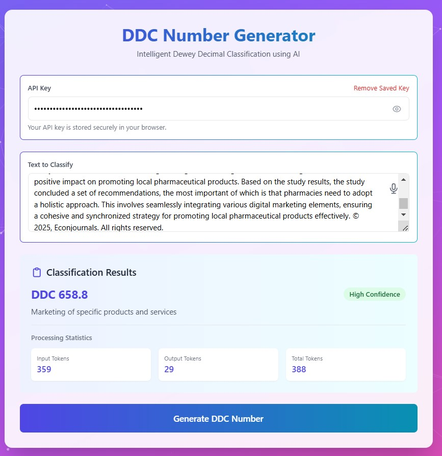

# DDC Number Generator

A modern web application that generates Dewey Decimal Classification (DDC) numbers using the Deepseek AI API. Built with Flask and featuring a responsive, interactive UI.



## Features

### Core Functionality
- Generate DDC numbers from text input
- AI-powered classification using Deepseek API
- Detailed classification results with descriptions
- Token usage tracking and statistics

### User Interface
- Modern, responsive design
- Interactive particle background
- Glass-morphism effects
- Progress indicators and animations
- Mobile-friendly layout

### Speech Recognition
- Voice input support
- Real-time speech-to-text conversion
- Visual feedback during recording
- Multi-language support (default: en-US)

### API Key Management
- Secure local storage of API keys
- Auto-load saved keys
- Show/hide key toggle
- Easy key removal option

## Installation

### Prerequisites
- Python 3.7 or higher
- pip (Python package installer)
- A Deepseek API key

### Step 1: Clone the Repository
```bash
git clone https://github.com/moradiashivam/ddc-generator.git
cd ddc-generator
```

### Step 2: Create Virtual Environment
```bash
# Windows
python -m venv venv
venv\Scripts\activate

# macOS/Linux
python3 -m venv venv
source venv/bin/activate
```

### Step 3: Install Dependencies
```bash
pip install -r requirements.txt
```

### Step 4: Set Up Environment Variables
Create a `.env` file in the project root:
```plaintext
FLASK_APP=app.py
FLASK_ENV=development
FLASK_DEBUG=1
```

### Step 5: Run the Application
```bash
flask run
```
Visit `http://localhost:5000` in your web browser.

## Project Structure
```
ddc-generator/
│
├── app.py                 # Main Flask application
├── templates/            
│   └── index.html        # HTML template
├── static/               
│   ├── css/             
│   │   └── style.css    # Custom styles
│   └── js/              
│       └── main.js      # JavaScript functionality
├── requirements.txt      # Project dependencies
├── .env                 # Environment variables
├── .gitignore          # Git ignore file
├── classifications.log  # Log of successful classifications
└── errors.log          # Error log file
```

## Usage

1. **Initial Setup**
   - Get your Deepseek API key from [platform.deepseek.com](https://platform.deepseek.com)
   - Enter your API key (it will be securely saved for future use)

2. **Text Input Methods**
   - Type directly into the text area
   - Click the microphone icon for voice input
   - Paste text from clipboard

3. **Generating DDC Numbers**
   - Enter or speak your text
   - Click "Generate DDC Number"
   - View the results, including:
     - DDC classification number
     - Description
     - Token usage statistics

4. **Managing API Keys**
   - Save: Click "Save Key" for new API keys
   - View: Use the eye icon to show/hide the key
   - Remove: Click "Remove Saved Key" to clear saved key

## Browser Compatibility

- Chrome (Recommended): Full support for all features
- Edge: Full support
- Firefox: All features except speech recognition
- Safari: Basic functionality, limited speech support
- Mobile browsers: Fully responsive design

## Development

### Adding New Features

1. Clone the repository
2. Create a new branch
```bash
git checkout -b feature/your-feature-name
```
3. Make your changes
4. Test thoroughly
5. Submit a pull request

### Running Tests
```bash
python -m pytest tests/
```

## Troubleshooting

### Common Issues

1. **Speech Recognition Not Working**
   - Ensure you're using a supported browser (Chrome/Edge)
   - Check microphone permissions
   - Verify HTTPS connection (required for speech API)

2. **API Key Issues**
   - Verify key is valid and active
   - Check for proper key format
   - Clear browser cache if issues persist

3. **Classification Errors**
   - Ensure text input is clear and specific
   - Check API response in browser console
   - Verify internet connection

## Contributing

1. Fork the repository
2. Create your feature branch
3. Commit your changes
4. Push to the branch
5. Create a new Pull Request

## License

This project is licensed under the MIT License - see the [LICENSE](LICENSE) file for details.

## Acknowledgments

- Deepseek API for AI classification
- Flask for the web framework
- Tailwind CSS for styling
- Particles.js for background effects

## Contact

- Author: Your Name
- Email: your.email@example.com
- GitHub: [@yourusername](https://github.com/yourusername)
